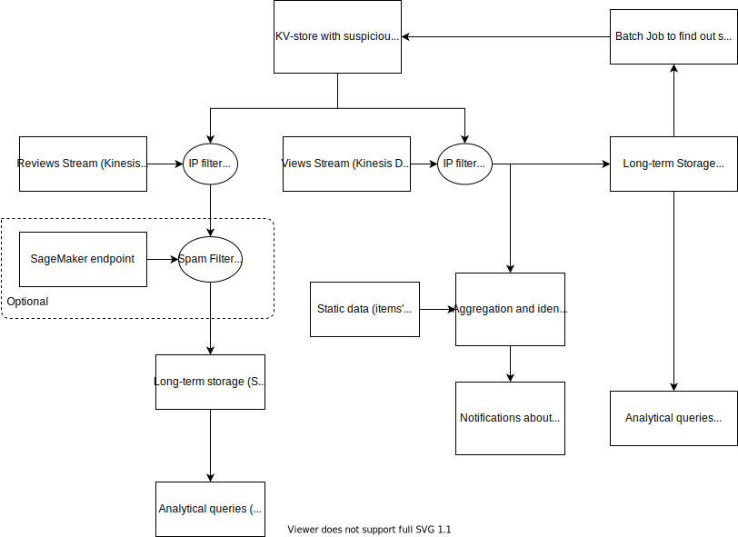

# Repository with materials for students of [Amazon Big Data GridU course](https://gridu.litmos.com/course/2859381)

Modules description:
* `cloudformation` Examples of templates for infrastructure deployment (EMR, Glue, EC2, S3)
* `log-generator` Python script which generates input data
* `utils` Examples of utility functions on top of `boto3` library for interaction with AWS

## High-level architecture of the project

